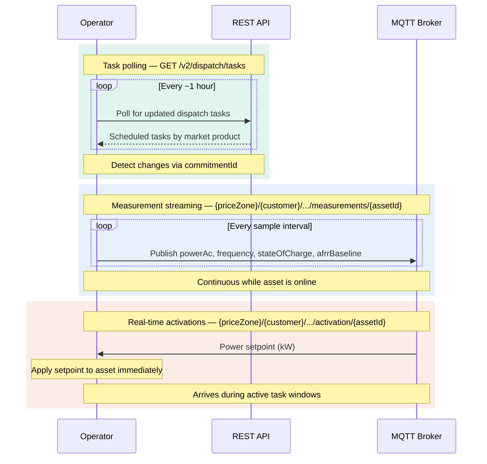

## Overview

A delegated operator is a third party that controls grid-connected assets — batteries, solar installations, and other distributed energy resources (DERs) — on behalf of the HGT platform. The integration surface has two layers:

| Layer | Protocol | Purpose |
|-------|----------|---------|
| **REST API** | HTTPS (JSON) | Authentication, asset/site discovery, availability schedules, dispatch task queries |
| **Real-time API** | MQTT 3.1.1 | Task dispatch, market activations, telemetry streaming, status reporting |

The REST API is for setup and monitoring. The MQTT layer is for time-critical, bidirectional communication between the platform and operator edge devices.

---

## Authentication

All REST calls require a bearer token obtained via the OAuth2 `client_credentials` grant.

```bash
curl -X POST https://operations.gridhub.dev/v2/auth/token \
  -H "Content-Type: application/x-www-form-urlencoded" \
  -d "client_id=YOUR_CLIENT_ID" \
  -d "client_secret=YOUR_CLIENT_SECRET" \
  -d "grant_type=client_credentials" \
  -d "scope=assets:read sites:read operations:read availability:read"
```

<Note>
  The `Content-Type` **must** be `application/x-www-form-urlencoded`. JSON bodies are rejected.
</Note>

### Default scopes

If you omit the `scope` parameter, the server issues `assets:read sites:read operations:read`. The `availability:read` scope is opt-in — you must request it explicitly.

### Using the token

Pass the returned `access_token` as a bearer header on all subsequent calls:

```
Authorization: Bearer <access_token>
```

The `expires_in` field tells you the token lifetime in seconds. Call `GET /v2/me` at any time to inspect the authenticated identity and granted scopes.

### MQTT credentials

MQTT connections use a separate `userPassword` credential pair generated during asset registration. These are per-asset and must be stored securely. Connection attempts with invalid credentials are logged and may trigger alerts.

<Warning>
  REST bearer tokens and MQTT credentials are independent. A valid REST token does not authorize MQTT connections, and vice versa.
</Warning>

---

## REST API — setup and monitoring

Once authenticated, use the REST API to discover your assets, sites, and scheduled operations.

### Assets

`GET /v2/assets` returns every asset owned by the authenticated customer, ordered alphabetically by `displayName`. Each asset includes an active specification snapshot — the row where `status = 'active'` and today falls within `[valid_from, valid_to]`.

```json title="Example BESS specification"
{
  "kind": "bess",
  "schema_version": 2,
  "metadata": {
    "build_year": 2010,
    "cell_count": 12,
    "rack_count": 6,
    "manufacturer": "ExampleCorp",
    "cell_technology": "LiPO",
    "cell_manufacturer": "CATL"
  },
  "specification": {
    "power": { "type": "static", "unit": "kW", "rated": 2000, "usable": 2000 },
    "efficiency": { "type": "static", "charge": 0.98, "discharge": 0.98 },
    "operational_soc": { "type": "static", "maximum": 0.95, "minimum": 0.05 },
    "storage_capacity": { "type": "static", "unit": "kWh", "rated": 3000, "usable": 3000 }
  }
}
```

<Note>
  The `specifications` field is an opaque JSON document. Its shape is governed by `kind` and `schema_version` and **may change between versions** without a breaking-change notice. Always version-gate your parsing on `schema_version` and tolerate unknown keys.
</Note>

### Sites and meters

`GET /v2/sites` returns every site owned by the authenticated customer, each with its own specification snapshot. Sites include geographic coordinates, address, price area (bidding zone), and site kind.

`GET /v2/sites/{site_id}/meters` returns the meters installed at a specific site, ordered with the main meter first. Each meter includes its GSM/EAN metering-point ID, installation date, and hierarchical parent reference.

<Note>
  A `404` on the meters endpoint is intentionally ambiguous — it means either the site was not found or it is not owned by the authenticated customer. This prevents ownership enumeration.
</Note>

### Availability

`GET /v2/availability` returns the latest availability schedule for a single asset within a time window. Each slot describes what the asset can deliver:

- `upwardCapacity` / `downwardCapacity` — maximum dispatchable power in each direction (in `capacityUnit`)
- `flexibleEnergy` / `mustRunEnergy` — energy commitments for the slot (in `energyUnit`)
- `products` — ancillary-service labels the asset is available for, e.g. `["fcrd"]`

The query window uses a half-open interval: slots are included when `from <= fromTime < to`.

### Dispatch tasks

`GET /v2/dispatch/tasks` returns the platform's scheduled dispatch instructions for a single asset. Each task describes a market product, direction, magnitude, and time window.

```json title="Example dispatch task"
{
  "taskId": 1042,
  "commitmentId": "a1b2c3d4-...",
  "startTime": "2025-03-15T08:00:00Z",
  "endTime": "2025-03-15T09:00:00Z",
  "taskTarget": "fcrd",
  "taskType": "delivery",
  "valueType": "discharge",
  "value": 1500.0,
  "unit": "kW",
  "priceZone": "dk1"
}
```

#### Detecting changes

The `commitmentId` field is your change-detection token:

- Same `(taskId, commitmentId)` across two polls → the trade is unchanged, no action needed.
- Same `taskId` with a **new**`commitmentId` → a new trade was made. Re-read the task and update your schedule.

#### Aggregation

Within a single 15-minute MTU, the platform may trade multiple times. For `afrr` and `wholesale` targets, overlapping trades in the same direction are summed into a single row. For all other targets, rows are returned as-is.

<Note>
  The query window is capped at 7 days (`to - from ≤ 7d`) and requires `to > from`.
</Note>

---

## Real-time API — MQTT operations

The MQTT layer handles all time-critical communication. It follows a pub/sub pattern where the platform publishes commands and the operator's edge devices publish telemetry and status.

### Topic hierarchy

Every MQTT topic follows this structure:

```
{priceZone}/{customerName}/{channel}/{assetId}
```

| Segment | Purpose | Examples |
|---------|---------|---------|
| `priceZone` | Geographic market area | `DK1`, `SE3`, `NO2` |
| `customerName` | Tenant namespace | `customer-abc-123` |
| `channel` | Message type | `tasks`, `activation`, `measurements`, `events`, `tasks/events` |
| `assetId` | Individual asset (UUID) | `f47ac10b-58cc-...` |

This hierarchy enables geographic grouping, multi-tenant isolation, and individual asset targeting in a single addressing scheme.

### Environments

| Environment | Host                          | Notes                                           |
| ----------- | ----------------------------- | ------------------------------------------------ |
| Sandbox     | `aggregator.gridhub.dev:8883` | Simulated assets, no real grid interactions     |
| Production  | `n1.link.gridhub.ai:8883`     | Real-time grid, strict security, production SLA |

### Channels — platform to operator

These channels carry commands from the platform to the operator's edge devices.

#### Tasks

**Topic:** `{priceZone}/{customerName}/tasks/{assetId}`

Task messages assign work to an asset: which market service to deliver, in which direction, at what magnitude, and for how long.

```json title="Task message"
{
  "sessionId": "uuid",
  "taskId": "uuid",
  "startTime": 1698422400000,
  "endTime": 1698426000000,
  "service": {
    "priceZone": "DK1",
    "serviceType": "afrr",
    "serviceEnvironment": "production"
  },
  "quantity": {
    "chargePower": 2000,
    "dischargePower": 2000,
    "unit": "kW"
  }
}
```

<Warning>
  Your implementation **must** validate task parameters, check asset availability, respect asset constraints, and acknowledge receipt within **30 seconds**.
</Warning>

#### Activations

**Topic:** `{priceZone}/{customerName}/activation/{assetId}`

Activation messages carry a real-time power setpoint tied to a specific market activation. These arrive during an active task when the grid needs the asset to respond.

```json title="Activation message"
{
  "eventId": "string",
  "timestamp": 1698422400000,
  "task": "uuid",
  "powerkW": 1500.0
}
```

### Channels — operator to platform

These channels carry telemetry and status from operator edge devices back to the platform.

#### Measurements

**Topic:** `{priceZone}/{customerName}/measurements/{assetId}`

Stream real-time telemetry from on-site measurement devices.

```json title="Measurement message"
{
  "assetId": "uuid",
  "eventId": "ulid",
  "measurementType": "powerAc",
  "payload": {
    "assetTimestamp": 1698422400000,
    "serverTimestamp": 1698422400100,
    "value": 1480.5,
    "unit": "kW"
  }
}
```

**Supported measurement types:**

| Type | Description |
|------|-------------|
| `frequency` | Grid frequency (Hz) |
| `powerAc` | AC power (kW) |
| `powerDc` | DC power (kW) |
| `stateOfCharge` | Battery SoC (%) |
| `afrrBaseline` | Sum of all setpoints except aFRR — used to compute delivered aFRR energy |
| `powerSocManagement` | Deprecated. The platform ignores the value. The enum value remains so that existing publishers do not fail validation. |

<Note>
  The `afrrBaseline` measurement is the sum of everything the battery is doing **except** aFRR. The platform uses this to calculate how much aFRR energy was actually delivered by subtraction.
</Note>

Required publish rates differ by measurement type and asset class. See [Data Standards](/delegated-operators/data-standards) for the sample interval of each type, the 250 ms delivery lag bound, and the clock requirements.

#### Task events

**Topic:** `{priceZone}/{customerName}/tasks/events/{assetId}`

Report the lifecycle status of dispatched tasks.

```json title="Task event message"
{
  "assetId": "uuid",
  "eventId": "ulid",
  "payload": {
    "assetTimestamp": 1698422400000,
    "serverTimestamp": 1698422400100,
    "taskId": "uuid",
    "taskStatus": "STARTED"
  }
}
```

**Task status values:** `STARTED`, `COMPLETED`, `FAILED`, `INVALID`, `UNAUTHORISED`

#### Events

**Topic:** `{priceZone}/{customerName}/events/{assetId}`

Report operational events from the site — networking issues, asset problems, or unavailability.

```json title="Event message"
{
  "assetId": "uuid",
  "eventId": "ulid",
  "payload": {
    "assetTimestamp": 1698422400000,
    "serverTimestamp": 1698422400100,
    "severity": "HIGH",
    "domain": "ASSET",
    "eventContext": {
      "code": "BATT_OVERTEMP",
      "description": "Battery temperature exceeded threshold"
    }
  }
}
```

**Severity levels:** `INFO`, `LOW`, `HIGH`, `CRITICAL`

**Event domains:** `NETWORKING`, `ASSET`, `NOTAVAILABLE`

---

## Timestamps and identifiers

| Field | Format | Notes |
|-------|--------|-------|
| MQTT timestamps (`startTime`, `serverTimestamp`, etc.) | Unix milliseconds since epoch | Synchronise to NTP or better, within 50 ms of UTC, correcting by slew. See [Data Standards](/delegated-operators/data-standards) |
| REST timestamps (`startTime`, `fromTime`, etc.) | ISO 8601 / RFC 3339 (UTC) | Used in query parameters and response bodies |
| Asset IDs | UUID v4 | Must be registered on the platform before use |
| Event IDs | ULID | Time-ordered, used for deduplication |
| Price zones | String code | `DK1`, `DK2`, `SE3`, `NO2`, etc. |

---

## Operations sequence

Once connected, the operator runs three concurrent loops against the platform:




**Task polling** runs on a slow cycle (typically hourly). The operator calls `GET /v2/dispatch/tasks` to retrieve the platform's planned schedule — which market product each asset is delivering, in which direction, at what magnitude, and for how long. Use the `commitmentId` field to detect whether a task has changed since the last poll.

**Measurement streaming** runs continuously over MQTT. The operator publishes telemetry for each online asset: AC power, grid frequency, state of charge, and the aFRR baseline. DC power is optional. The required sample interval depends on the asset class and the measurement type, and ranges from 100 ms to 5 s. See [Data Standards](/delegated-operators/data-standards).

**Real-time activations** are event-driven. During an active task window, the platform pushes power setpoints over MQTT. When one arrives, ramp the asset toward the specified power level immediately. The platform must receive a measurement showing the response within 1 second for a BESS and 5 seconds for PV. Discard an activation that is older on receipt than that bound, or that a newer activation for the same task has superseded.

<Note>
  These three loops run concurrently. Task polling tells the operator **what to expect**. Measurements tell the platform **what the asset is doing**. Activations tell the operator **what to do right now**.
</Note>

## Market products reference

The platform dispatches tasks for these ancillary services and energy markets:

| Product              | Code (MQTT) | Code (REST) | Description                                          |
| -------------------- | ----------- | ----------- | ---------------------------------------------------- |
| FCR-D                | `fcrd`      | `fcrd`      | Frequency Containment Reserve — Disturbance          |
| FCR-N                | `fcrn`      | `fcrn`      | Frequency Containment Reserve — Normal               |
| FCR                  | —           | `fcr`       | Frequency Containment Reserve (generic)              |
| aFRR                 | `afrr`      | `afrr`      | automatic Frequency Restoration Reserve              |
| FFR                  | —           | `ffr`       | Fast Frequency Reserve                               |
| Day-ahead & Intraday | `wholesale` | `wholesale` | Wholesale energy (intraday continuous and day-ahead) |

<Note>
  The REST API also supports `off` (asset idle) and `ffr` / `fcr` which are not present in the current MQTT schema.
</Note>

---

## Dispatch direction reference

The `valueType` field on dispatch tasks describes what the asset should do:

| Value type | Meaning |
|------------|---------|
| `charge` | Asset **absorbs** the specified power (kW) |
| `discharge` | Asset **delivers** the specified power (kW) |
| `symmetric` | Asset reserves the specified power in **both directions** simultaneously (e.g. FCR-N) |
| `off` | No dispatch; value is `0` |

The `value` field is always non-negative. Direction is carried entirely by `valueType`, never by the sign.
