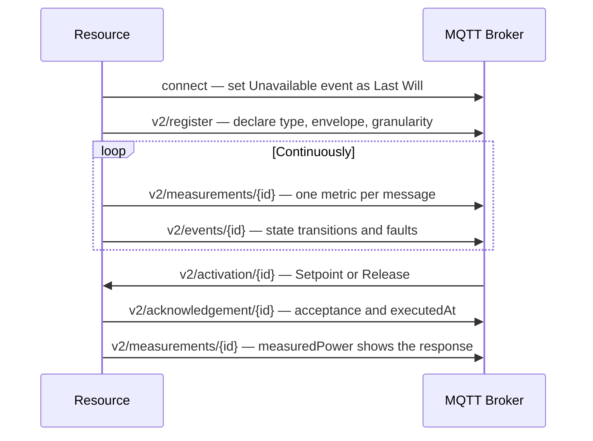

## Overview

One API covers every distributed energy resource. Registration, telemetry, events, dispatch, and acknowledgement use the same topics and the same message shapes for every resource type. The resource type changes two things: which metrics you publish, and which `configuration` block you declare at registration.

The integration is MQTT-only. There is no REST layer for resources.

| Environment | Host | Port |
|-------------|------|------|
| Sandbox | `aggregator.gridhub.dev` | `8883` |
| Production | `n1.link.gridhub.ai` | `8883` |

All topics follow the pattern:

```
{priceZone}/{customerName}/v2/{channel}/{resourceId}
```

| Segment | Description |
|---------|-------------|
| `priceZone` | Grid bidding zone. One of `DK1` or `DK2`. |
| `customerName` | Namespace assigned during onboarding. |
| `v2` | API version segment. |
| `channel` | One of `register`, `update`, `measurements`, `events`, `activation`, or `acknowledgement`. |
| `resourceId` | The resource the message concerns. Absent on `register`, which carries an array. |

Neither the site nor the portfolio appears in the topic. Portfolio membership is administrative, and a resource that moves between portfolios keeps its topic and its credentials.

<Note>
  Payloads are flat JSON in camelCase. There is no nested `payload` wrapper on any channel.
</Note>

---

## Prerequisites

- MQTTS client (TLS 1.2+)
- Per-resource credentials issued during onboarding (username / password)
- A `resourceId` — a stable string identifier you choose for the resource
- `priceZone`: one of `DK1`, `DK2`
- `customerName`: your assigned namespace

<Warning>
  Credentials are per-resource, and each resource holds its own connection. Do not share credentials across resources — the platform uses the connection's Last Will and Testament to detect that one specific resource has gone dark.
</Warning>

Set the Last Will and Testament when you connect, before you publish anything. See [Step 3](#step-3-—-report-events).

---

## Step 1 — Register the resource

Registration declares what the resource is and the envelope it can be dispatched within. The payload is always an array, so one resource and a fleet register through the same channel.

**Topic:** `{priceZone}/{customerName}/v2/register`

<Tabs>
  <Tab title="EV charger">

    ```json title="Registering an AC charge point"
    {
      "messageId": "01ABCDEFGHJKMNPQRSTVWXYZ01",
      "timestamp": 1788344077482,
      "resources": [
        {
          "resourceId": "evse-site-a-01",
          "resourceType": "evCharger",
          "subscriptionStatus": "Subscribed",
          "maxImportKw": 11,
          "maxExportKw": 0,
          "controlGranularity": {
            "mode": "Continuous",
            "minKw": -11,
            "maxKw": -1.4
          },
          "marketRelationships": {
            "balanceResponsibleParty": { "code": "5790001234567", "encoding": "GS1" },
            "retailer": { "code": "5790009876543", "encoding": "GS1" }
          },
          "configuration": {
            "currentType": "AC"
          }
        }
      ]
    }
    ```

    A charge point cannot export, so `maxExportKw` is `0`. The continuous band stops at `-1.4` kW because a charge point cannot hold an arbitrarily small current — below the band, the only reachable setpoint is `0`.

  </Tab>
  <Tab title="Heat pump">

    ```json title="Registering a heat pump with staged equipment"
    {
      "messageId": "01ABCDEFGHJKMNPQRSTVWXYZ02",
      "timestamp": 1788344077482,
      "resources": [
        {
          "resourceId": "hp-site-b-01",
          "resourceType": "heatPump",
          "subscriptionStatus": "Subscribed",
          "maxImportKw": 9,
          "maxExportKw": 0,
          "controlGranularity": {
            "mode": "Steps",
            "stepsKw": [-9, -6, -3, -1.5, 0]
          },
          "marketRelationships": {
            "balanceResponsibleParty": { "code": "5790001234567", "encoding": "GS1" },
            "retailer": { "code": "5790009876543", "encoding": "GS1" }
          },
          "configuration": {
            "compressorRatedPowerKw": 6,
            "backupHeaterRatedPowerKw": 3
          }
        }
      ]
    }
    ```

    Compressor and backup heater stages are unequal in size, so a heat pump declares its reachable setpoints as a list rather than a band. Without the list, "nearest achievable setpoint" is guesswork.

  </Tab>
  <Tab title="Battery">

    ```json title="Registering a residential battery"
    {
      "messageId": "01ABCDEFGHJKMNPQRSTVWXYZ03",
      "timestamp": 1788344077482,
      "resources": [
        {
          "resourceId": "bess-site-c-01",
          "resourceType": "bess",
          "subscriptionStatus": "Subscribed",
          "maxImportKw": 5,
          "maxExportKw": 5,
          "controlGranularity": {
            "mode": "Continuous",
            "minKw": -5,
            "maxKw": 5
          },
          "marketRelationships": {
            "balanceResponsibleParty": { "code": "5790001234567", "encoding": "GS1" },
            "retailer": { "code": "5790009876543", "encoding": "GS1" }
          },
          "configuration": {
            "powerRatedKw": 5,
            "powerUsableKw": 5,
            "storageRatedKwh": 13.5,
            "storageUsableKwh": 12.8,
            "minSoc": 10,
            "maxSoc": 100,
            "chargeEfficiency": 0.96,
            "dischargeEfficiency": 0.96
          }
        }
      ]
    }
    ```

    A battery occupies both directions, so `maxExportKw` is non-zero and the continuous band crosses zero.

  </Tab>
  <Tab title="CHP">

    ```json title="Registering a combined heat and power unit"
    {
      "messageId": "01ABCDEFGHJKMNPQRSTVWXYZ04",
      "timestamp": 1788344077482,
      "resources": [
        {
          "resourceId": "chp-site-d-01",
          "resourceType": "chp",
          "subscriptionStatus": "Subscribed",
          "maxImportKw": 0,
          "maxExportKw": 9,
          "controlGranularity": {
            "mode": "Steps",
            "stepsKw": [0, 4.5, 9]
          },
          "marketRelationships": {
            "balanceResponsibleParty": { "code": "5790001234567", "encoding": "GS1" },
            "retailer": { "code": "5790009876543", "encoding": "GS1" }
          },
          "configuration": {}
        }
      ]
    }
    ```

    A CHP exports rather than consumes, so `maxImportKw` is `0` and the reachable setpoints are all non-negative. `configuration` is empty: the dispatch envelope comes from the rated power and `controlGranularity` alone.

  </Tab>
  <Tab title="P2X">

    ```json title="Registering a power-to-X plant"
    {
      "messageId": "01ABCDEFGHJKMNPQRSTVWXYZ05",
      "timestamp": 1788344077482,
      "resources": [
        {
          "resourceId": "p2x-site-e-01",
          "resourceType": "p2x",
          "subscriptionStatus": "Subscribed",
          "maxImportKw": 50,
          "maxExportKw": 0,
          "controlGranularity": {
            "mode": "Continuous",
            "minKw": -50,
            "maxKw": 0
          },
          "marketRelationships": {
            "balanceResponsibleParty": { "code": "5790001234567", "encoding": "GS1" },
            "retailer": { "code": "5790009876543", "encoding": "GS1" }
          },
          "configuration": {}
        }
      ]
    }
    ```

    A P2X plant consumes across a continuous band down to zero power. `configuration` is empty.

  </Tab>
  <Tab title="PV">

    ```json title="Registering a rooftop photovoltaic array"
    {
      "messageId": "01ABCDEFGHJKMNPQRSTVWXYZ41",
      "timestamp": 1788344077482,
      "resources": [
        {
          "resourceId": "pv-site-g-01",
          "resourceType": "pv",
          "subscriptionStatus": "Subscribed",
          "maxImportKw": 0,
          "maxExportKw": 6,
          "controlGranularity": {
            "mode": "Continuous",
            "minKw": 0,
            "maxKw": 6
          },
          "marketRelationships": {
            "balanceResponsibleParty": { "code": "5790001234567", "encoding": "GS1" },
            "retailer": { "code": "5790009876543", "encoding": "GS1" }
          },
          "configuration": {
            "latitude": 55.68,
            "longitude": 12.57,
            "systemLoss": 0.11,
            "moduleGroups": [
              { "capacityKwp": 5, "azimuth": 0, "inclination": 35 },
              { "capacityKwp": 2.4, "azimuth": -90, "inclination": 35 }
            ]
          }
        }
      ]
    }
    ```

    An array exports rather than consumes, so `maxImportKw` is `0` and every reachable setpoint is non-negative. A setpoint below current production is curtailment, and `Release` returns the array to producing whatever the sun allows. An inverter that accepts only stepped limits declares `Steps` instead, listing the outputs it can reach.

    This roof has two faces, so it declares two module groups. Their 7.4 kWp of DC capacity exceeds the 6 kW inverter, and the surplus is clipped. `systemLoss` is optional, and the platform applies `0.14` when you omit it.

    | Direction | `azimuth` |
    |-----------|-----------|
    | South | `0` |
    | East | `90` |
    | West | `-90` |
    | North | `180` or `-180` |

    <Warning>
      Azimuth is measured in degrees from **true** south, positive toward east. Two conversions catch integrators out: a tool that measures from north, and a tool that measures from south with west positive. Both produce values inside the valid range, so nothing rejects them — the first shifts the forecast by half a day, the second mirrors morning and afternoon production.
    </Warning>

  </Tab>
  <Tab title="Other">

    ```json title="Registering equipment with no resource type of its own"
    {
      "messageId": "01ABCDEFGHJKMNPQRSTVWXYZ06",
      "timestamp": 1788344077482,
      "resources": [
        {
          "resourceId": "misc-site-f-01",
          "resourceType": "misc",
          "subscriptionStatus": "Subscribed",
          "maxImportKw": 12,
          "maxExportKw": 0,
          "controlGranularity": {
            "mode": "Continuous",
            "minKw": -12,
            "maxKw": 0
          },
          "marketRelationships": {
            "balanceResponsibleParty": { "code": "5790001234567", "encoding": "GS1" },
            "retailer": { "code": "5790009876543", "encoding": "GS1" }
          },
          "configuration": {}
        }
      ]
    }
    ```

    `misc` is the catch-all for dispatchable equipment that has no type of its own yet. It registers and is dispatched exactly like any other resource, and `configuration` is empty.

  </Tab>
</Tabs>

### What the envelope means

| Field | What the platform does with it |
|-------|-------------------------------|
| `maxImportKw` | Bounds the import end of the setpoint range. A commanded setpoint never falls below `-maxImportKw`. |
| `maxExportKw` | Bounds the export end. `0` for a resource that can only consume. |
| `controlGranularity` | The setpoints the resource can actually reach. The platform commands a target, and the resource applies the nearest reachable value. |
| `marketRelationships` | Places the resource in a portfolio. |
| `configuration` | Type-specific equipment properties. |

Which markets a resource trades is not declared here. Market enrolment is commercial data the platform owns, and it determines the portfolio rather than following from it.

<Note>
  `resourceId` and `resourceType` are immutable. Equipment of a different class registers as a new resource.
</Note>

---

## Step 2 — Stream measurements

Publish one metric per message. The platform does not accept batched payloads.

**Topic:** `{priceZone}/{customerName}/v2/measurements/{resourceId}`

Every measurement uses the same envelope. `measuredPower` is signed and follows the generator convention: **export is positive, import is negative**. A charge point drawing 7.2 kW publishes `-7.2`.

<Tabs>
  <Tab title="EV charger">

    A charge point drawing 7.2 kW of an 11 kW maximum publishes three metrics. The headroom values are the consumption it can shed and the consumption it can add, both measured from `-7.2` kW.

    ```json title="measuredPower"
    {
      "messageId": "01ABCDEFGHJKMNPQRSTVWXYZ10",
      "resourceId": "evse-site-a-01",
      "measurementType": "measuredPower",
      "value": -7.2,
      "unit": "kW",
      "resourceTimestamp": 1788344077482,
      "serverTimestamp": 1788344077549
    }
    ```

    ```json title="availablePowerUp"
    {
      "messageId": "01ABCDEFGHJKMNPQRSTVWXYZ11",
      "resourceId": "evse-site-a-01",
      "measurementType": "availablePowerUp",
      "value": 7.2,
      "unit": "kW",
      "resourceTimestamp": 1788344077482,
      "serverTimestamp": 1788344077549
    }
    ```

    ```json title="availablePowerDown"
    {
      "messageId": "01ABCDEFGHJKMNPQRSTVWXYZ12",
      "resourceId": "evse-site-a-01",
      "measurementType": "availablePowerDown",
      "value": 3.8,
      "unit": "kW",
      "resourceTimestamp": 1788344077482,
      "serverTimestamp": 1788344077549
    }
    ```

  </Tab>
  <Tab title="Heat pump">

    A heat pump running its compressor at 3 kW of a 9 kW maximum publishes the same three metrics. It can shed all 3 kW, and add 6 kW by staging the compressor and the backup heater.

    ```json title="measuredPower"
    {
      "messageId": "01ABCDEFGHJKMNPQRSTVWXYZ13",
      "resourceId": "hp-site-b-01",
      "measurementType": "measuredPower",
      "value": -3,
      "unit": "kW",
      "resourceTimestamp": 1788344077482,
      "serverTimestamp": 1788344077549
    }
    ```

    ```json title="availablePowerUp"
    {
      "messageId": "01ABCDEFGHJKMNPQRSTVWXYZ14",
      "resourceId": "hp-site-b-01",
      "measurementType": "availablePowerUp",
      "value": 3,
      "unit": "kW",
      "resourceTimestamp": 1788344077482,
      "serverTimestamp": 1788344077549
    }
    ```

    ```json title="availablePowerDown"
    {
      "messageId": "01ABCDEFGHJKMNPQRSTVWXYZ15",
      "resourceId": "hp-site-b-01",
      "measurementType": "availablePowerDown",
      "value": 6,
      "unit": "kW",
      "resourceTimestamp": 1788344077482,
      "serverTimestamp": 1788344077549
    }
    ```

  </Tab>
  <Tab title="Battery">

    A battery discharging 4.2 kW at 94% state of charge publishes all six metrics. `measuredPower` is positive because the battery is exporting, and the energy metrics are independent of `stateOfCharge` — at 94% there is little left to absorb.

    ```json title="measuredPower"
    {
      "messageId": "01ABCDEFGHJKMNPQRSTVWXYZ18",
      "resourceId": "bess-site-c-01",
      "measurementType": "measuredPower",
      "value": 4.2,
      "unit": "kW",
      "resourceTimestamp": 1788344077482,
      "serverTimestamp": 1788344077549
    }
    ```

    ```json title="availablePowerUp"
    {
      "messageId": "01ABCDEFGHJKMNPQRSTVWXYZ19",
      "resourceId": "bess-site-c-01",
      "measurementType": "availablePowerUp",
      "value": 0.8,
      "unit": "kW",
      "resourceTimestamp": 1788344077482,
      "serverTimestamp": 1788344077549
    }
    ```

    ```json title="availablePowerDown"
    {
      "messageId": "01ABCDEFGHJKMNPQRSTVWXYZ20",
      "resourceId": "bess-site-c-01",
      "measurementType": "availablePowerDown",
      "value": 9.2,
      "unit": "kW",
      "resourceTimestamp": 1788344077482,
      "serverTimestamp": 1788344077549
    }
    ```

    ```json title="stateOfCharge"
    {
      "messageId": "01ABCDEFGHJKMNPQRSTVWXYZ23",
      "resourceId": "bess-site-c-01",
      "measurementType": "stateOfCharge",
      "value": 94,
      "unit": "%",
      "resourceTimestamp": 1788344077482,
      "serverTimestamp": 1788344077549
    }
    ```

    ```json title="availableEnergyUp"
    {
      "messageId": "01ABCDEFGHJKMNPQRSTVWXYZ24",
      "resourceId": "bess-site-c-01",
      "measurementType": "availableEnergyUp",
      "value": 10.8,
      "unit": "kWh",
      "resourceTimestamp": 1788344077482,
      "serverTimestamp": 1788344077549
    }
    ```

    ```json title="availableEnergyDown"
    {
      "messageId": "01ABCDEFGHJKMNPQRSTVWXYZ25",
      "resourceId": "bess-site-c-01",
      "measurementType": "availableEnergyDown",
      "value": 0.8,
      "unit": "kWh",
      "resourceTimestamp": 1788344077482,
      "serverTimestamp": 1788344077549
    }
    ```

  </Tab>
  <Tab title="CHP">

    A CHP exporting 4.5 kW of a 9 kW maximum publishes the same three metrics as a heat pump. `measuredPower` is positive because the unit is exporting, and the headroom values are the output it can add and the output it can drop.

    ```json title="measuredPower"
    {
      "messageId": "01ABCDEFGHJKMNPQRSTVWXYZ26",
      "resourceId": "chp-site-d-01",
      "measurementType": "measuredPower",
      "value": 4.5,
      "unit": "kW",
      "resourceTimestamp": 1788344077482,
      "serverTimestamp": 1788344077549
    }
    ```

    ```json title="availablePowerUp"
    {
      "messageId": "01ABCDEFGHJKMNPQRSTVWXYZ27",
      "resourceId": "chp-site-d-01",
      "measurementType": "availablePowerUp",
      "value": 4.5,
      "unit": "kW",
      "resourceTimestamp": 1788344077482,
      "serverTimestamp": 1788344077549
    }
    ```

    ```json title="availablePowerDown"
    {
      "messageId": "01ABCDEFGHJKMNPQRSTVWXYZ28",
      "resourceId": "chp-site-d-01",
      "measurementType": "availablePowerDown",
      "value": 4.5,
      "unit": "kW",
      "resourceTimestamp": 1788344077482,
      "serverTimestamp": 1788344077549
    }
    ```

  </Tab>
  <Tab title="P2X">

    A P2X plant drawing 30 kW of a 50 kW maximum publishes the same three metrics. It can shed all 30 kW of consumption and add 20 kW more.

    ```json title="measuredPower"
    {
      "messageId": "01ABCDEFGHJKMNPQRSTVWXYZ31",
      "resourceId": "p2x-site-e-01",
      "measurementType": "measuredPower",
      "value": -30,
      "unit": "kW",
      "resourceTimestamp": 1788344077482,
      "serverTimestamp": 1788344077549
    }
    ```

    ```json title="availablePowerUp"
    {
      "messageId": "01ABCDEFGHJKMNPQRSTVWXYZ32",
      "resourceId": "p2x-site-e-01",
      "measurementType": "availablePowerUp",
      "value": 30,
      "unit": "kW",
      "resourceTimestamp": 1788344077482,
      "serverTimestamp": 1788344077549
    }
    ```

    ```json title="availablePowerDown"
    {
      "messageId": "01ABCDEFGHJKMNPQRSTVWXYZ33",
      "resourceId": "p2x-site-e-01",
      "measurementType": "availablePowerDown",
      "value": 20,
      "unit": "kW",
      "resourceTimestamp": 1788344077482,
      "serverTimestamp": 1788344077549
    }
    ```

  </Tab>
  <Tab title="PV">

    A rooftop array producing 4.2 kW through a 6 kW inverter publishes the same three metrics as a heat pump. `measuredPower` is positive because the array is generating, and it reports AC production at the inverter output whether that power reaches the grid or is consumed on site.

    Uncurtailed, the array has nothing to add: `availablePowerUp` is `0` because irradiance already claims the headroom, and `availablePowerDown` is the whole 4.2 kW that can be curtailed away. Curtail it to 1 kW and the two swap — up `3.2`, down `1`. Both fall to `0` after sunset.

    ```json title="measuredPower"
    {
      "messageId": "01ABCDEFGHJKMNPQRSTVWXYZ42",
      "resourceId": "pv-site-g-01",
      "measurementType": "measuredPower",
      "value": 4.2,
      "unit": "kW",
      "resourceTimestamp": 1788344077482,
      "serverTimestamp": 1788344077549
    }
    ```

    ```json title="availablePowerUp"
    {
      "messageId": "01ABCDEFGHJKMNPQRSTVWXYZ43",
      "resourceId": "pv-site-g-01",
      "measurementType": "availablePowerUp",
      "value": 0,
      "unit": "kW",
      "resourceTimestamp": 1788344077482,
      "serverTimestamp": 1788344077549
    }
    ```

    ```json title="availablePowerDown"
    {
      "messageId": "01ABCDEFGHJKMNPQRSTVWXYZ44",
      "resourceId": "pv-site-g-01",
      "measurementType": "availablePowerDown",
      "value": 4.2,
      "unit": "kW",
      "resourceTimestamp": 1788344077482,
      "serverTimestamp": 1788344077549
    }
    ```

    The array reports its own production, not the site's net position. Add a battery to this site absorbing 3 kW and nothing about the array's measurements changes: the array still publishes `4.2`, and the battery publishes `-3` on its own topic as a separate `bess` resource.

  </Tab>
  <Tab title="Other">

    A `misc` resource publishes the same three metrics, whatever the equipment is. The platform reads the metrics, not the equipment class.

    ```json title="measuredPower"
    {
      "messageId": "01ABCDEFGHJKMNPQRSTVWXYZ36",
      "resourceId": "misc-site-f-01",
      "measurementType": "measuredPower",
      "value": -8,
      "unit": "kW",
      "resourceTimestamp": 1788344077482,
      "serverTimestamp": 1788344077549
    }
    ```

    ```json title="availablePowerUp"
    {
      "messageId": "01ABCDEFGHJKMNPQRSTVWXYZ37",
      "resourceId": "misc-site-f-01",
      "measurementType": "availablePowerUp",
      "value": 8,
      "unit": "kW",
      "resourceTimestamp": 1788344077482,
      "serverTimestamp": 1788344077549
    }
    ```

    ```json title="availablePowerDown"
    {
      "messageId": "01ABCDEFGHJKMNPQRSTVWXYZ38",
      "resourceId": "misc-site-f-01",
      "measurementType": "availablePowerDown",
      "value": 4,
      "unit": "kW",
      "resourceTimestamp": 1788344077482,
      "serverTimestamp": 1788344077549
    }
    ```

  </Tab>
</Tabs>

### What each resource type publishes

| `resourceType` | Publishes |
|----------------|-----------|
| `evCharger`, `heatPump`, `chp`, `p2x`, `pv`, `misc` | `measuredPower`, `availablePowerUp`, `availablePowerDown` |
| `bess` | The above three, plus `stateOfCharge`, `availableEnergyUp`, and `availableEnergyDown` |

The obligation is additive. Units, bounds, and change thresholds are on [Metrics](/data-standards/metrics), and the market sets the bound on the power metrics.

### Available power is headroom

`availablePowerUp` and `availablePowerDown` are unsigned magnitudes measured **from the current operating point**, not ratings. Both are already net of every reservation and planned event outside the platform's control, including any reserve the resource holds back for itself.

- A value floors at `0` when something outside the platform's control has claimed the capability.
- A value never exceeds what the equipment can physically reach.
- A charge point drawing 7.2 kW of an 11 kW maximum has 7.2 kW of `availablePowerUp` — the consumption it can shed — and 3.8 kW of `availablePowerDown`.
- Site constraints live inside the value, not beside it. Where the metered connection point, a site controller, or other equipment behind the same meter caps what the resource may import or export, subtract that cap before publishing. A 9 kW heat pump on a site already importing 17 kW of a 20 kW connection reports 3 kW of `availablePowerDown`, not the 6 kW the compressor and heater could take.

<Warning>
  Publish available power as a sampled value, not as a rating adjusted by arithmetic. The platform dispatches up to the last value you published, and a setpoint is only interpretable against `measuredPower`. That is why every resource type publishes measured power, heat pumps included.
</Warning>

### Battery state metrics

`stateOfCharge`, `availableEnergyUp`, and `availableEnergyDown` are three independent measurements. Reservations outside the platform's control move the usable floor and ceiling independently of the state of charge, so none of the three is derivable from the others. Publish all three as sampled values.

---

## Step 3 — Report events

Publish an event whenever the resource's dispatch-relevant condition changes.

**Topic:** `{priceZone}/{customerName}/v2/events/{resourceId}`

```json title="Event message"
{
  "messageId": "01ABCDEFGHJKMNPQRSTVWXYZ05",
  "resourceId": "evse-site-a-01",
  "eventKind": "Status",
  "resourceState": "Available",
  "severity": "INFO",
  "sessionState": "Charging",
  "resourceTimestamp": 1788344077482,
  "serverTimestamp": 1788344077549
}
```

### Resource states

| `resourceState` | Meaning |
|-----------------|---------|
| `Available` | Dispatchable, and running under its own control logic. |
| `Unavailable` | Not dispatchable. |
| `Activated` | Holding a setpoint the platform commanded. |
| `Faulted` | Not dispatchable because of an equipment fault. |

Direction is carried by the activation, so there is one `Activated` state rather than one per direction.

<Warning>
  Publishing the transition to `Unavailable` is mandatory. A resource going dark must be an affirmative message, never something the platform has to infer from silence.
</Warning>

Use `eventKind: "Error"` for fault conditions, and carry the partner-defined identifier in `code` and the account of it in `description`. Both are free text; the platform stores them and does not branch on them.

`sessionState` is optional and meaningful for EV chargers only. OCPP session states — `Charging`, `Preparing`, `SuspendedEV`, `SuspendedEVSE`, `Reserved` — describe a charging session rather than a readiness to be dispatched, so they sit beside `resourceState` rather than inside it.

### Last Will and Testament

Set the events topic as the connection's Last Will and Testament, at QoS 1 and without the retain flag, carrying a `Status` event with `resourceState: "Unavailable"`.

```json title="Last Will and Testament payload"
{
  "messageId": "01ABCDEFGHJKMNPQRSTVWXYZ06",
  "resourceId": "evse-site-a-01",
  "eventKind": "Status",
  "resourceState": "Unavailable",
  "severity": "HIGH",
  "code": "ConnectionLost",
  "description": "Connection to the platform closed without a disconnect",
  "resourceTimestamp": null,
  "serverTimestamp": 1788344012004
}
```

Set `resourceTimestamp` to `null`. The will is composed when the connection opens, so it cannot carry the time the link dropped; the platform stamps its own receipt time on the transition.

There is no heartbeat message on this API. Liveness rests on three layers: the will for connection liveness, mandatory `Unavailable` events for resource liveness, and gap detection against the market data frequency as the backstop.

---

## Step 4 — Receive activations

Subscribe to the activation channel. Two commands exist.

**Topic:** `{priceZone}/{customerName}/v2/activation/{resourceId}`

<Tabs>
  <Tab title="Setpoint">

    ```json title="Hold 3.7 kW of consumption"
    {
      "messageId": "01ABCDEFGHJKMNPQRSTVWXYZ07",
      "resourceId": "evse-site-a-01",
      "activation": "Setpoint",
      "setpoint": -3.7,
      "unit": "kW",
      "endsAt": 1788347677482,
      "serverTimestamp": 1788344077482
    }
    ```

    `setpoint` is signed on the generator convention and falls within `[-maxImportKw, maxExportKw]`. `endsAt` is always present. It is the time at which the obligation to hold the setpoint ends, and it lets the resource revert safely if the link to the platform drops.

  </Tab>
  <Tab title="Release">

    ```json title="Return to your own control logic"
    {
      "messageId": "01ABCDEFGHJKMNPQRSTVWXYZ08",
      "resourceId": "evse-site-a-01",
      "activation": "Release",
      "serverTimestamp": 1788344677482
    }
    ```

    A release carries no `setpoint` and no `endsAt`.

  </Tab>
</Tabs>

<Warning>
  **A release is not a setpoint of zero.** `0` kW is a valid instruction to hold zero power, and the resource stays under platform control until it is released. Only `Release` returns the resource to its own control logic.
</Warning>

### A setpoint is a target, not a ceiling

Apply the nearest value your declared `controlGranularity` allows, and let `measuredPower` report what you achieved. The platform assesses the response as movement toward the commanded value, so a resource whose steps straddle the target meets the bound by moving to the nearest step.

A heat pump that declared `[-9, -6, -3, -1.5, 0]` and receives `-4` applies `-3`. It does not refuse the command, and it does not stage equipment to synthesise `-4`.

### Stale activations

Activations are delivered at QoS 1, so a reconnection can deliver a command that is already old. Discard an activation when either holds:

- Its `serverTimestamp` is older on receipt than the roundtrip bound for the resource's market.
- A newer activation for the same resource has already been applied.

---

## Step 5 — Acknowledge activations

Every activation is acknowledged, for every resource type.

**Topic:** `{priceZone}/{customerName}/v2/acknowledgement/{resourceId}`

```json title="Acknowledgement message"
{
  "messageId": "01ABCDEFGHJKMNPQRSTVWXYZ09",
  "resourceId": "evse-site-a-01",
  "activationId": "01ABCDEFGHJKMNPQRSTVWXYZ07",
  "acceptance": "Accepted",
  "executedAt": 1788344077731
}
```

`activationId` carries the `messageId` of the activation being answered.

### Acceptance values

| `acceptance` | Meaning |
|--------------|---------|
| `Accepted` | The resource applied the command. |
| `Rejected` | The resource refused the command. |
| `Offline` | The resource is not reachable from the partner's system. |
| `NotAvailable` | The resource is reachable but not dispatchable. |
| `InvalidResourceId` | `resourceId` does not match a registered resource. |
| `InvalidMessageFormat` | The payload could not be parsed. |
| `InternalError` | The command failed for a reason on the partner's side. |
| `Unauthorised` | The partner's system refused the command on authorisation grounds. |

Detail specific to a resource type goes in `reason`, as free text:

```json title="Not dispatchable, with a type-specific cause"
{
  "messageId": "01ABCDEFGHJKMNPQRSTVWXYZ10",
  "resourceId": "evse-site-a-01",
  "activationId": "01ABCDEFGHJKMNPQRSTVWXYZ07",
  "acceptance": "NotAvailable",
  "reason": "No vehicle connected",
  "executedAt": 1788344077698
}
```

Set `executedAt` to the time of the decision when `acceptance` is anything other than `Accepted`.

<Note>
  Acknowledgements are mandatory even where the measurement stream already shows the resource moving. An acknowledgement carries a reason for non-response, and separates a refusal to actuate from a lost link. A stream of power values expresses neither.
</Note>

---

## Updating a registered resource

Publish only the fields you are changing. Fields absent from the message are left unchanged.

**Topic:** `{priceZone}/{customerName}/v2/update/{resourceId}`

```json title="Derating after an electrical inspection"
{
  "messageId": "01ABCDEFGHJKMNPQRSTVWXYZ11",
  "timestamp": 1788344077482,
  "resourceId": "evse-site-a-01",
  "maxImportKw": 7.4,
  "controlGranularity": {
    "mode": "Continuous",
    "minKw": -7.4,
    "maxKw": -1.4
  }
}
```

To withdraw a resource from dispatch without deleting its registration, send `subscriptionStatus: "Unsubscribed"`. The record is retained and the resource can be re-subscribed later.

`resourceType` cannot be updated.

`configuration` is replaced as a whole rather than merged field by field. Send every property the variant requires, including the ones that are not changing: a battery resends all eight, and a PV array resends its coordinates and every module group.

---

## Summary



Migrating an existing EV charger or heat pump integration? See [Migrating to v2](/distributed-resources/migration).
