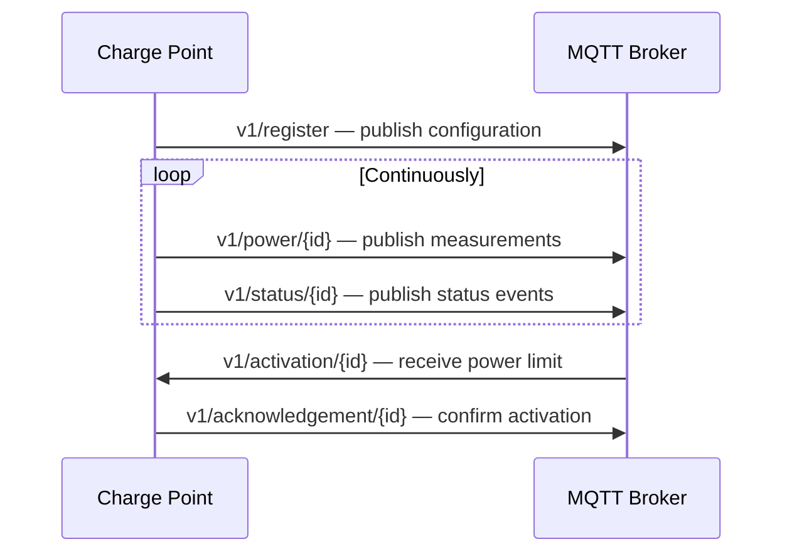

## Overview

This guide walks through integrating an OCPP-compatible EV charge point (EVSE) with the HGT platform. The integration is MQTT-only — there is no REST layer for EV chargers. Everything happens over a persistent MQTTS connection.

| Environment | Host | Port |
|-------------|------|------|
| Sandbox | `aggregator.gridhub.dev` | `8883` |
| Production | `n1.link.gridhub.ai` | `8883` |

All topics follow the pattern:

```
{priceZone}/{customerName}/v1/{channel}/{resourceId}
```

---

## Prerequisites

- MQTTS client (TLS 1.2+)
- Per-resource credentials issued during onboarding (username / password)
- A `resourceId` — a stable string identifier for the charge point you control
- `priceZone`: one of `DK1`, `DK2`
- `customerName`: your assigned namespace

<Warning>
  Credentials are per-resource. Each charge point has its own username/password pair. Do not share credentials across resources.
</Warning>

---

## Step 1 — Register the resource

Before the platform can dispatch the charge point, you must register it. Registration is idempotent on first publish but **not a PATCH** — send updates via the `v1/update/{resourceId}` channel instead.

**Topic:** `{priceZone}/{customerName}/v1/register`

```json title="Registration message"
{
  "timestamp": 1698422400000,
  "event_id": "01ABCDEFGHJKMNPQRSTVWXYZ01",
  "resource_id": "evse-site-a-01",
  "capability": ["Basic"],
  "current_type": "AC",
  "subscription_status": "Subscribed",
  "schedule": null,
  "market_relationships": {
    "balance_responsible_party": {
      "code": "5790001234567",
      "encoding": "GS1"
    }
  }
}
```

### Capability levels

| Capability | What it enables |
|-----------|----------------|
| `Basic` | Binary on/off control only |
| `Standard` | Power limit control |
| `Enhanced` | Power limit + schedule awareness |
| `Full` | Full control including real-time telemetry |
| `DynamicBinning` | Declared but not used at runtime |

<Note>
  If `capability` is omitted, the platform defaults to `["Basic"]`. Upgrading capability requires an explicit update message.
</Note>

### Bulk registration

To register multiple charge points at once, publish an array of configuration objects to the bulk topic:

**Topic:** `{priceZone}/{customerName}/v1/bulk/register`

```json title="Bulk registration message"
[
  {
    "timestamp": 1698422400000,
    "event_id": "01ABCDEFGHJKMNPQRSTVWXYZ01",
    "resource_id": "evse-site-a-01",
    "capability": ["Standard"],
    "subscription_status": "Subscribed"
  },
  {
    "timestamp": 1698422400000,
    "event_id": "01ABCDEFGHJKMNPQRSTVWXYZ02",
    "resource_id": "evse-site-a-02",
    "capability": ["Standard"],
    "subscription_status": "Subscribed"
  }
]
```

---

## Step 2 — Stream power measurements

Publish power readings continuously from each charge point.

**Topic:** `{priceZone}/{customerName}/v1/power/{resourceId}`

```json title="Power measurement message"
{
  "event_id": "01ABCDEFGHJKMNPQRSTVWXYZ03",
  "resource_id": "evse-site-a-01",
  "power_kw": 7.2,
  "timestamp_evse": 1698422400000,
  "timestamp_server": 1698422400100
}
```

<Note>
  `timestamp_evse` is the time recorded by the EVSE hardware. `timestamp_server` is when the message was prepared for dispatch. If the hardware clock is unreliable, `timestamp_evse` may be `null`.
</Note>

---

## Step 3 — Report status events

Send status updates whenever the charge point state changes — car connects, charging starts, fault occurs, etc.

**Topic:** `{priceZone}/{customerName}/v1/status/{resourceId}`

```json title="Status event message"
{
  "event_id": "01ABCDEFGHJKMNPQRSTVWXYZ04",
  "resource_id": "evse-site-a-01",
  "status": "Charging",
  "time_since_heartbeat": null,
  "timestamp_evse": 1698422400000,
  "timestamp_server": 1698422400100
}
```

### OCPP status values

| Status | Meaning |
|--------|---------|
| `Available` | Idle, ready to charge |
| `Preparing` | Cable connected, waiting for authorisation |
| `Charging` | Active charging session |
| `SuspendedEV` | EV paused charging |
| `SuspendedEVSE` | Charger paused charging |
| `Reserved` | Reserved for a specific user |
| `Unavailable` | Out of service |
| `Faulted` | Hardware fault |
| `Offline` | No connectivity |

---

## Step 4 — Receive activations

Subscribe to the activation channel. The platform sends power limit commands here during active market windows.

**Topic:** `{priceZone}/{customerName}/v1/activation/{resourceId}`

Two activation message versions are in use:

<Tabs>
  <Tab title="v2 (current)">

    ```json title="SetPowerLimit"
    {
      "event_id": "01ABCDEFGHJKMNPQRSTVWXYZ05",
      "resource_id": "evse-site-a-01",
      "activation": "SetPowerLimit",
      "timestamp": 1698422400000,
      "power_limit_kw": 3.7,
      "ends_at": 1698426000000
    }
    ```

    ```json title="ClearPowerLimit"
    {
      "event_id": "01ABCDEFGHJKMNPQRSTVWXYZ06",
      "resource_id": "evse-site-a-01",
      "activation": "ClearPowerLimit",
      "timestamp": 1698422400000,
      "power_limit_kw": null,
      "ends_at": null
    }
    ```

    v2 includes `resource_id` in the payload — use this for additional validation.

  </Tab>
  <Tab title="v1 (legacy)">

    ```json title="SetPowerLimit"
    {
      "event_id": "01ABCDEFGHJKMNPQRSTVWXYZ05",
      "activation": "SetPowerLimit",
      "timestamp": 1698422400000,
      "power_limit_kw": 3.7,
      "ends_at": 1698426000000
    }
    ```

    v1 omits `resource_id` from the payload — infer the target from the topic.

  </Tab>
</Tabs>

### Bulk activations

The platform may activate multiple charge points in a single message:

**Topic:** `{priceZone}/{customerName}/v1/bulk/activation`

```json title="Bulk activation message"
[
  {
    "event_id": "01ABCDEFGHJKMNPQRSTVWXYZ07",
    "resource_id": "evse-site-a-01",
    "activation": "SetPowerLimit",
    "timestamp": 1698422400000,
    "power_limit_kw": 3.7,
    "ends_at": 1698426000000
  },
  {
    "event_id": "01ABCDEFGHJKMNPQRSTVWXYZ08",
    "resource_id": "evse-site-a-02",
    "activation": "SetPowerLimit",
    "timestamp": 1698422400000,
    "power_limit_kw": 3.7,
    "ends_at": 1698426000000
  }
]
```

---

## Step 5 — Acknowledge activations

Every activation must be acknowledged. The platform uses acknowledgements to confirm delivery and track response latency.

**Single resource acknowledgement topic:** `{priceZone}/{customerName}/v1/acknowledgement/{resourceId}`

**Bulk acknowledgement topic:** `{priceZone}/{customerName}/v1/bulk/acknowledgement`

```json title="Acknowledgement message"
{
  "event_id": "01ABCDEFGHJKMNPQRSTVWXYZ05",
  "resource_id": "evse-site-a-01",
  "timestamp": 1698422400050,
  "acceptance": "Accepted",
  "sent_at": 1698422400000,
  "executed_at": 1698422400050
}
```

### Acceptance codes

| Code | Meaning |
|------|---------|
| `Accepted` | Activation applied successfully |
| `RejectedByEvse` | EVSE declined the command |
| `EvseOffline` | Charge point is not reachable |
| `EvDisconnected` | No EV connected |
| `NoEvCharging` | EV connected but not actively charging |
| `InvalidEvseId` | `resource_id` does not match a known resource |
| `InvalidMessageFormat` | Payload could not be parsed |
| `InternalError` | Unexpected error on your side |
| `Unauthorised` | Credentials rejected |

---

## Updating a registered resource

To modify a registered charge point's capability, schedule, subscription status, or market relationships, publish to the update channel:

**Topic:** `{priceZone}/{customerName}/v1/update/{resourceId}`

```json title="Update message"
{
  "event_id": "01ABCDEFGHJKMNPQRSTVWXYZ09",
  "resource_id": "evse-site-a-01",
  "data": {
    "capability": ["Standard", "Enhanced"],
    "subscription_status": "Subscribed",
    "schedule": {
      "starts_at": "06:00",
      "ends_at": "22:00"
    }
  }
}
```

Only the fields provided in `data` are modified. Fields not included are left unchanged.

---

## Unsubscribing a resource

To remove a charge point from platform control without deleting its registration record, send an update with `subscription_status: "Unsubscribed"`. The resource data is retained and can be re-subscribed later.

---

## Summary


