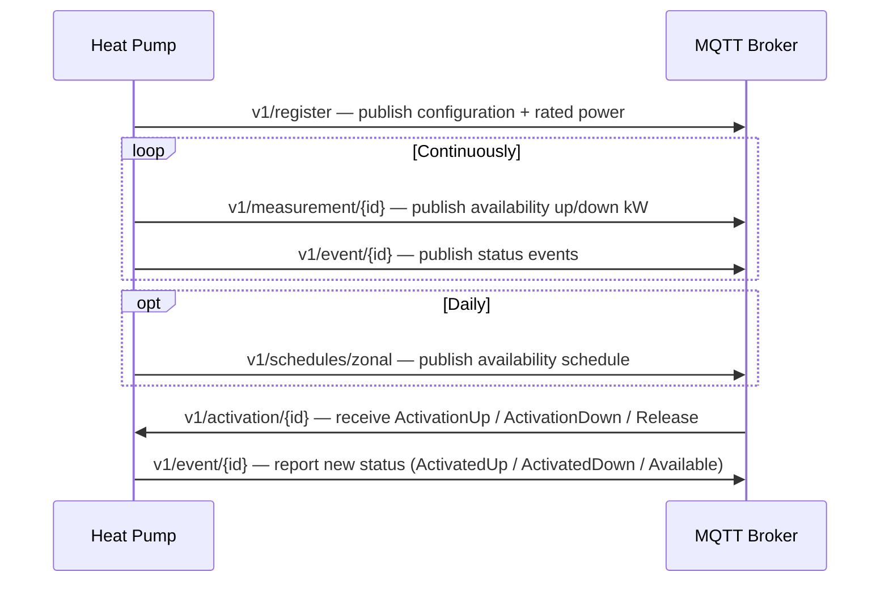

## Overview

This guide covers integrating a heat pump as a distributed energy resource (DER) with the HGT platform. The integration is MQTT-only over a persistent MQTTS connection. Compared to EV chargers, the heat pump integration is simpler: activations use a directional model (up/down/release) rather than power limits, and there are no acknowledgements required.

| Environment | Host | Port |
|-------------|------|------|
| Sandbox | `aggregator.gridhub.dev` | `8883` |
| Production | `n1.link.gridhub.ai` | `8883` |

All topics follow the pattern:

```
{priceZone}/{customerName}/v1/{channel}/{resourceId}
```

---

## Prerequisites

- MQTTS client (TLS 1.2+)
- Per-resource credentials issued during onboarding (username / password)
- A `resourceId` — a stable string identifier for the heat pump
- `priceZone`: one of `DK1`, `DK2`
- `customerName`: your assigned namespace

<Warning>
  Credentials are per-resource. Each heat pump has its own username/password pair. Do not share credentials across resources.
</Warning>

---

## Step 1 — Register the resource

Register the heat pump before the platform can dispatch it. The registration payload includes the hardware specifications that the platform uses when sizing activations.

**Topic:** `{priceZone}/{customerName}/v1/register`

```json title="Registration message"
{
  "eventId": "01ABCDEFGHJKMNPQRSTVWXYZ01",
  "timestamp": 1698422400000,
  "payload": [
    {
      "resourceId": "hp-site-a-01",
      "subscriptionStatus": "Subscribed",
      "priceZone": "DK1",
      "configuration": {
        "compressorRatedPowerKW": 6.0,
        "backupHeaterRatedPowerKW": 3.0
      }
    }
  ]
}
```

The `payload` field is an array — you can register multiple heat pumps in a single message by including more entries.

### Configuration fields

| Field | Description |
|-------|-------------|
| `compressorRatedPowerKW` | Rated power of the compressor in kW. Used to determine upward flexibility. |
| `backupHeaterRatedPowerKW` | Rated power of the backup/auxiliary heater in kW. Used to determine downward flexibility. |

<Note>
  Both power values are used by the platform when scheduling activations. Provide accurate values from the equipment datasheet. Inaccurate values will cause the platform to over- or under-dispatch the asset.
</Note>

---

## Step 2 — Stream measurements

Publish availability measurements continuously. Unlike EV chargers, heat pumps publish how much upward and downward flexibility they currently have available — not raw power readings.

**Topic:** `{priceZone}/{customerName}/v1/measurement/{resourceId}`

```json title="Measurement message"
{
  "eventId": "01ABCDEFGHJKMNPQRSTVWXYZ02",
  "resourceId": "hp-site-a-01",
  "payload": {
    "resourceTimestamp": 1698422400000,
    "serverTimestamp": 1698422400100,
    "availableUpKw": 6.0,
    "availableDownKw": 3.0
  }
}
```

| Field | Description |
|-------|-------------|
| `availableUpKw` | How much power the compressor can currently increase by (kW) |
| `availableDownKw` | How much power the backup heater can currently increase by (kW) |

<Note>
  `resourceTimestamp` may be `null` if the heat pump hardware does not have a reliable clock. Use `serverTimestamp` as the primary time reference in that case.
</Note>

---

## Step 3 — Report status events

Send an event whenever the heat pump's operational status changes.

**Topic:** `{priceZone}/{customerName}/v1/event/{resourceId}`

```json title="Event message"
{
  "eventId": "01ABCDEFGHJKMNPQRSTVWXYZ03",
  "resourceId": "hp-site-a-01",
  "eventKind": "Status",
  "payload": {
    "resourceTimestamp": 1698422400000,
    "serverTimestamp": 1698422400100,
    "status": "Available"
  }
}
```

### Status values

| Status | Meaning |
|--------|---------|
| `Available` | Idle and ready for activation |
| `ActivatedUp` | Currently executing an ActivationUp command |
| `ActivatedDown` | Currently executing an ActivationDown command |
| `Unavailable` | Not available for control (fault, maintenance, etc.) |

Use `eventKind: "Error"` instead of `"Status"` when reporting a fault condition.

---

## Step 4 — Receive activations

Subscribe to the activation channel. The platform sends directional commands here during market windows.

**Topic:** `{priceZone}/{customerName}/v1/activation/{resourceId}`

```json title="ActivationUp — increase compressor output"
{
  "eventId": "01ABCDEFGHJKMNPQRSTVWXYZ04",
  "resourceId": "hp-site-a-01",
  "timestamp": 1698422400000,
  "payload": {
    "activation": "ActivationUp",
    "endsAt": 1698426000000
  }
}
```

```json title="ActivationDown — engage backup heater"
{
  "eventId": "01ABCDEFGHJKMNPQRSTVWXYZ05",
  "resourceId": "hp-site-a-01",
  "timestamp": 1698422400000,
  "payload": {
    "activation": "ActivationDown",
    "endsAt": 1698426000000
  }
}
```

```json title="Release — return to normal operation"
{
  "eventId": "01ABCDEFGHJKMNPQRSTVWXYZ06",
  "resourceId": "hp-site-a-01",
  "timestamp": 1698422400000,
  "payload": {
    "activation": "Release",
    "endsAt": null
  }
}
```

### Activation model

| Command | Action |
|---------|--------|
| `ActivationUp` | Run compressor at full rated power to absorb upward flexibility (e.g. consume excess grid power) |
| `ActivationDown` | Engage backup heater to consume downward flexibility (e.g. increase load to stabilise frequency) |
| `Release` | Exit the activation and return the heat pump to its normal control logic |

<Warning>
  React to `Release` promptly. The platform issues it at the end of a market activation window. Staying activated beyond `endsAt` will cause measurement discrepancies and may affect settlement.
</Warning>

After receiving an activation, send a status event reflecting the new state (`ActivatedUp`, `ActivatedDown`, or `Available` after a release).

---

## Step 5 — Publish zonal schedules (optional)

If your system performs smart-charging optimisation or price-based scheduling, you can share this with the platform. The platform uses this to understand when the heat pump will be available for control.

**Topic:** `{priceZone}/{customerName}/v1/schedules/zonal`

```json title="Zonal schedule profile"
{
  "eventId": "01ABCDEFGHJKMNPQRSTVWXYZ07",
  "data": [
    {
      "time_start": 1698422400000,
      "time_end": 1698426000000,
      "is_turn_off_heating": false
    },
    {
      "time_start": 1698426000000,
      "time_end": 1698429600000,
      "is_turn_off_heating": true
    }
  ]
}
```

Publish one zonal schedule per day. When `is_turn_off_heating` is `true` for a slot, the platform will not dispatch the heat pump during that window.

<Note>
  When the schedule spans a DST boundary, either duplicate or skip the affected hour in your `data` array. The platform interprets timestamps in UTC.
</Note>

---

## Key differences from EV chargers

| Behaviour | EV Chargers | Heat Pumps |
|-----------|-------------|-----------|
| Activation model | Power limit (kW value) | Directional (Up / Down / Release) |
| Acknowledgement required | Yes | No |
| Bulk operations | Yes | No |
| Measurements | Raw power (kW) | Availability (up/down kW) |
| Zonal schedules | No | Yes |

---

## Summary


